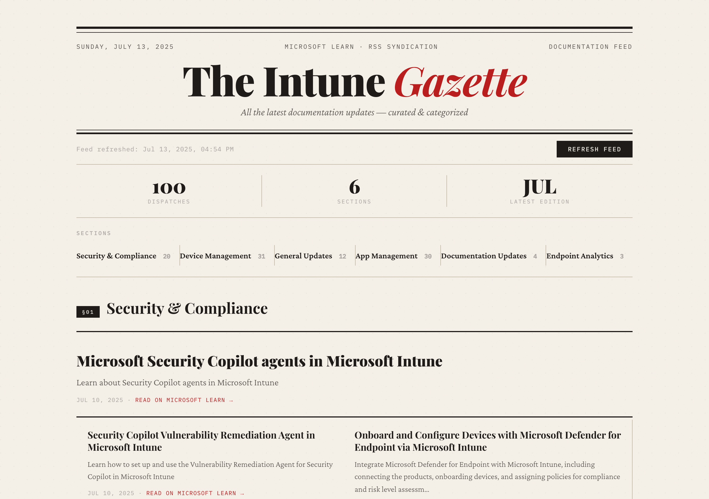

# The Intune Gazette

Example: [jorgeasaurus.github.io/IntuneDocsAutomation](https://jorgeasaurus.github.io/IntuneDocsAutomation/)



An editorial-style dashboard that automatically tracks and displays the latest Microsoft Intune documentation updates from Microsoft Learn. Designed with a broadsheet newspaper aesthetic — Playfair Display serifs, two-column article grids, and warm cream paper tones.

## Features

- **Automated RSS Feed Updates** — GitHub Actions workflow downloads RSS data every 6 hours
- **Broadsheet Layout** — Newspaper-inspired masthead, section markers (`§01`, `§02`), two-column article grid, and lead story treatment
- **Smart Categorization** — Automatically groups updates into Security, Apps, Devices, Analytics, Policy, and Documentation
- **Inline Navigation** — Horizontal section index with item counts for quick jumping
- **Stats Ribbon** — Total dispatches, active sections, and latest edition at a glance
- **GitHub Pages Ready** — Static single-file site, no build step required
- **No CORS Issues** — Uses a local RSS file committed by the Actions workflow

## Setup

### 1. Repository
1. Fork or clone this repository
2. Push to your GitHub account
3. Enable GitHub Actions in your repository settings

### 2. GitHub Pages
1. Go to **Settings → Pages**
2. Under **Source**, select "Deploy from a branch"
3. Choose **main** branch and **/ (root)** folder
4. Click **Save**

### 3. Actions Permissions
1. Go to **Settings → Actions → General**
2. Under **Workflow permissions**, select "Read and write permissions"
3. Check "Allow GitHub Actions to create and approve pull requests"
4. Click **Save**

### 4. First Run
1. Go to the **Actions** tab
2. Click "Update Intune RSS Feed"
3. Click **Run workflow** to trigger it manually

## How It Works

The GitHub Actions workflow (`.github/workflows/update-rss.yml`):

1. **Downloads** the latest RSS feed from Microsoft Learn
2. **Validates** the XML content
3. **Diffs** against the previous version
4. **Commits** the updated `intune-rss.xml` and `rss-metadata.json` if anything changed
5. **Deploys** to GitHub Pages automatically

**Schedule:** every 6 hours via cron, plus manual dispatch and push triggers.

## Customization

### Categories
Edit the `categoryMapping` object in `index.html`:

```javascript
const categoryMapping = {
    'Security & Compliance': ['security', 'compliance', 'baseline'],
    'App Management': ['app', 'application', 'store'],
    // Add your own...
};
```

### Update Frequency
Modify the cron in `.github/workflows/update-rss.yml`:

```yaml
schedule:
  - cron: '0 */3 * * *'   # every 3 hours
```

### Styling
All CSS is embedded in `index.html` via CSS custom properties. Key tokens:

| Variable | Purpose | Default |
|---|---|---|
| `--paper` | Background | `#F5F0E8` |
| `--ink` | Primary text | `#1C1917` |
| `--accent` | Links & highlights | `#B91C1C` |
| `--serif` | Headlines | Playfair Display |
| `--body` | Body text | Crimson Pro |
| `--mono` | Metadata & labels | IBM Plex Mono |

Key layout classes: `.masthead`, `.stats-ribbon`, `.toc-bar`, `.category-section`, `.updates-grid`, `.update-card`, `.lead-story`, `.colophon`.

## Local Development

```bash
# Python
python3 -m http.server 8080

# Node
npx http-server -p 8080

# Then open http://localhost:8080
```

## Troubleshooting

| Problem | Fix |
|---|---|
| Workflow not running | Check Actions permissions are set to "Read and write" |
| No data showing | Run the workflow manually; verify `intune-rss.xml` exists |
| Blank page locally | Use a local server — don't open the HTML file directly |

## File Structure

```
├── .github/workflows/
│   └── update-rss.yml        # Automated RSS fetch workflow
├── index.html                 # The Gazette — single-file dashboard
├── intune-rss.xml             # RSS feed data (auto-generated)
├── rss-metadata.json          # Feed metadata (auto-generated)
├── code.code-workspace        # VS Code workspace config
└── README.md
```

## Contributing

1. Fork the repository
2. Create a feature branch
3. Make your changes
4. Test locally
5. Submit a pull request

## License

This project is open source and available under the MIT License.

## Links

- [Microsoft Learn — Intune](https://learn.microsoft.com/en-us/intune/)
- [RSS Feed Source](https://docs.microsoft.com/api/search/rss?locale=en-us&facet=&%24filter=scopes%2Fany%28t%3A+t+eq+%27Intune%27%29)
- [GitHub Pages](https://pages.github.com/)
- [GitHub Actions](https://docs.github.com/en/actions)